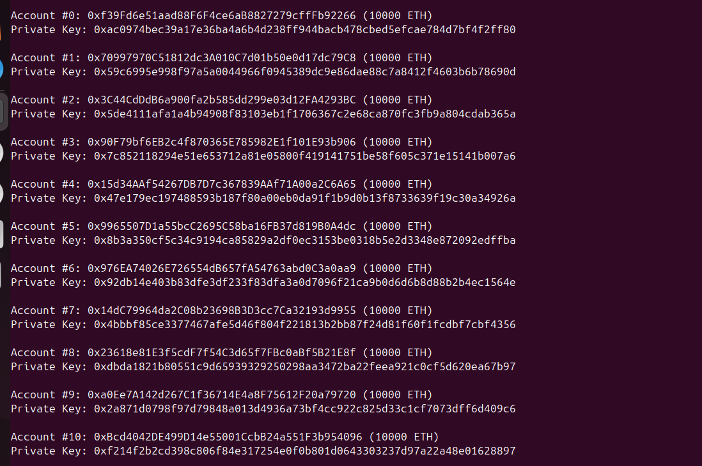
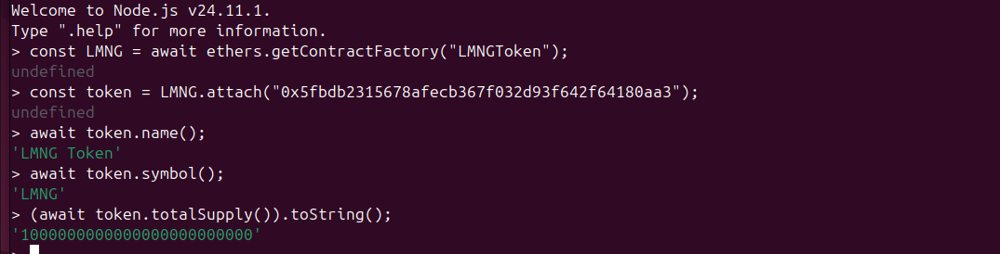
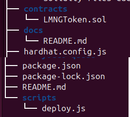

# LMNG Token – Smart Contract Project (Hardhat v2)

This repository demonstrates a complete end-to-end Ethereum smart contract workflow using **Hardhat v2**, **Ethers.js v5**, and a **local development blockchain**.  
It is designed as a clean, professional sample to showcase blockchain engineering expertise for GitHub, Upwork, Fiverr, and other freelancing platforms.

---

## Features

- Hardhat v2 development environment  
- Ethers.js v5 integration  
- Local blockchain simulation using `npx hardhat node`  
- Automated deployment script (`scripts/deploy.js`)  
- Minimal ERC-style token contract (`contracts/LMNGToken.sol`)  
- Clean, client-ready project structure  
- Easy to extend with tests, CI/CD, or frontend dApps

---

## Project Structure

```text
senior-blockchain-architecture-lmng/
├── contracts/
│   └── LMNGToken.sol
│
├── scripts/
│   └── deploy.js
│
├── docs/
│   ├── README.md
│   ├── chains-and-tokens-spec.md
│   ├── hardhat-node.png
│   ├── contract-deployment.png
│   ├── contract-interaction.png
│   └── project-structure.png
│
├── artifacts/                # Auto-generated by Hardhat
├── cache/                    # Auto-generated by Hardhat
├── node_modules/             # Ignored by Git
│
├── hardhat.config.js
├── package.json
├── package-lock.json
└── README.md

Getting Started
Prerequisites
Node.js (LTS recommended)
npm
Git
Install dependencies:
npm install

Deploy Locally
1. Start the Hardhat Local Node
npx hardhat node
This launches a local Ethereum network with pre-funded, unlocked accounts suitable for development and testing.

2. Deploy the LMNGToken Contract
In a second terminal, from the project root:
npx hardhat run scripts/deploy.js --network localhost
You will see output similar to:
Contract deployment: LMNGToken
Contract address: 0x5fbdb2315678afecb367f032d93f642f64180aa3
Transaction: 0x...
Gas used: ...
Copy the contract address; you will need it to interact with the token.

Interact With the Contract
1. Open Hardhat Console
npx hardhat console --network localhost

2. Attach to the Deployed Contract
const LMNG = await ethers.getContractFactory("LMNGToken");
const token = LMNG.attach("0x5fbdb2315678afecb367f032d93f642f64180aa3"); // replace with your actual deployed address

3. Read Public Values
await token.name();          // "LMNG Token"
await token.symbol();        // "LMNG"
(await token.totalSupply()).toString();

Documentation
Additional design notes and token/chain considerations are documented in:
docs/chains-and-tokens-spec.md
This file explains the broader architecture decisions and how this simple token can fit into a larger blockchain system.

Screenshots
These screenshots are stored in the docs/ folder and referenced here for easy access.

### 1. Hardhat Local Node Running


### 2. Contract Deployment


### 3. Contract Interaction


### 4. Project Structure



1. Hardhat Local Node Running
Showing the local blockchain with unlocked accounts.

2. Contract Deployment
Output of deploying LMNGToken to the local network using Hardhat.

3. Contract Interaction
Reading name, symbol, and totalSupply via Hardhat console.

4. Project Structure
Clean and professional directory layout as shown by tree -L 2

About This Project
This repository is a portfolio-quality example demonstrating:
Solidity smart contract development
Local blockchain orchestration with Hardhat
Deployment and interaction using Ethers.js
Professional repository organization
Development workflow on Ubuntu

It can be extended with:
Unit/integration tests
CI/CD (GitHub Actions)
Advanced token logic (minting, burning, access control)
Frontend integration (React/Next.js, Web3.js/Ethers.js)

Feel free to fork, extend, or reference this project in your own blockchain engineering work.

## Skills Demonstrated
- Solidity smart contract development  
- Hardhat v2 environment setup and configuration  
- Local blockchain simulation and debugging  
- Contract deployment using Ethers.js v5  
- Contract interaction using Hardhat console  
- Professional repository structuring for client-facing projects  
- Ubuntu-based development workflow  
- Git & GitHub version control best practices  
- Markdown documentation and project presentation
